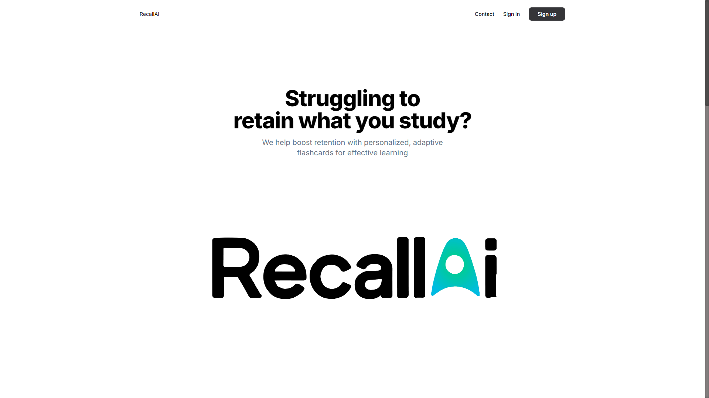

# RecallAI

**RecallAI** helps you learn and retain information more effectively by generating personalized flashcards using advanced AI technology. Whether you're studying for exams, learning a new language, or simply wanting to improve your knowledge in a specific area, our platform creates tailored flashcards that adapt to your learning needs.



## 📺 Watch the Demo

See RecallAI in action on YouTube: [YouTube Demo](https://www.youtube.com/watch?v=HBxXpbbjl1Q)

## 🔧 Key Features

- **Personalized Learning**: Our AI tailors flashcards to your unique learning style, ensuring you focus on what matters most.
- **Unlimited Access with Premium**: Upgrade for unlimited flashcards, custom decks, and ad free study sessions.
- **Collaborative Learning**: Share your flashcards with friends or study groups to enhance your learning experience.
- **Security First**: Your data is encrypted and securely stored, so you can focus on studying without worries.

## 💻 Tech Stack

- **Frontend**: Next.js, Tailwind CSS
- **Tools**: Spline
- **Database**: Firebase
- **Payment Gateway**: Stripe
- **Model**: LLaMA 8b Model
- **Authentication**: Clerk

## 🛠 Installation & Setup

To setup RecallAI locally on your machine, follow these steps:

1. **Clone the repository**:

    ```bash
    git clone https://github.com/RecallAI-App/RecallAI.git
    cd RecallAI
    ```

2. **Install dependencies**:

    ```bash
    npm install
    ```

3. **Set up environment variables**:

   Create a `.env` file in the root directory and add your keys:

    ```plaintext
    NEXT_PUBLIC_STRIPE_PUBLIC_KEY=<Your-Stripe-Public>
    STRIPE_SECRET_KEY=<Your-Stripe-Secret>

    API_BASE=<OpenAI endpoint>
    API_KEY=<Openai key>

    NEXT_PUBLIC_APP_URL=<Your-Development_url>
    NEXT_PUBLIC_CLERK_PUBLISHABLE_KEY=<Your-Clerk-Key>
    CLERK_SECRET_KEY=<Your-Clerk-Secret>
    CLERK_WEBHOOK_SECRET=<Your-Clerk-Webhook>
    ```

4. **Run the development server**:

    ```bash
    npm run dev
    ```

    Open [http://localhost:3000](http://localhost:3000) to view it in the browser.

## 🙏 Acknowledgments

We extend our heartfelt gratitude to the entire Headstarter team, particularly **Yasin Ehsan** 🚀 and **Faizan Ahmed**, for their unwavering support and for cultivating an environment in which innovation can flourish.

## 🌟 Contributors

- [Abhishek Shrestha](https://github.com/Abhiabhishek5124)
- [Dawn Saju](https://github.com/dawnsaju/)
- [Sivaibala Karthikeyan](https://github.com/Mythical633/)

## 📄 License

This project is licensed under the MIT License - see the [LICENSE.md](LICENSE.md) file for details.

## 💬 Let's Connect

Interested in learning more? Let's connect! Feel free to drop your questions in the comments below or reach out directly.

## 🔗 Links

- [Try Now](https://recall-ai.me/)
- [GitHub Repository](https://github.com/RecallAI-App/RecallAI)
- [YouTube Demo](https://www.youtube.com/watch?v=HBxXpbbjl1Q)

## 📢 Follow us on LinkedIn
- [Abhishek Shrestha](https://www.linkedin.com/in/abhishekshrestha5125/)
- [Dawn Saju](https://www.linkedin.com/in/dawnsaju/)
- [Sivaibala Karthikeyan](https://www.linkedin.com/in/sivaibala-k-3234b1282/)